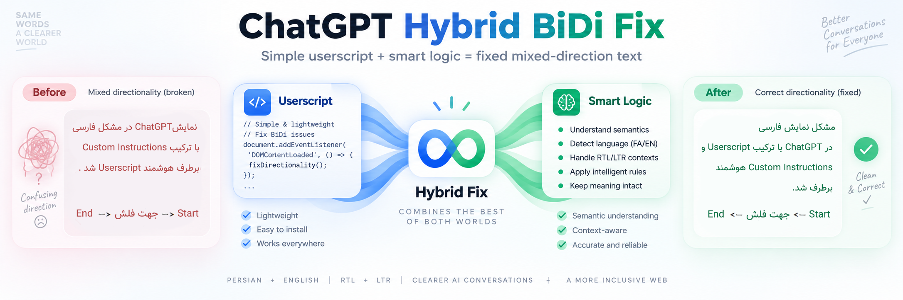

# ChatGPT Persian RTL Fix (Hybrid-Method)


A hybrid Persian RTL / mixed-direction fix for ChatGPT.

The project combines:

- **ChatGPT Custom Instructions** to decide semantic direction and workflow order.
- **A userscript** to apply RTL/LTR in the browser and remove direction markers.

<p align="center">
  
</p>

## How it works

ChatGPT adds one of these markers:

```text
[[RTL]]
[[LTR]]
```

The userscript detects the marker, applies the correct direction, and removes it from the rendered response.

This helps with:

- Persian + English mixed text
- UI paths
- Arrows and workflows
- Filenames and inline code
- RTL list items
- `→`, `←`, `>`, `<`

## Installation

1. Install Tampermonkey or another compatible userscript manager.
2. Install [`chatgpt-hybrid-bidi-fix.user.js`](./chatgpt-hybrid-bidi-fix.user.js).
3. Copy [`CUSTOM_INSTRUCTIONS.md`](./CUSTOM_INSTRUCTIONS.md) into ChatGPT Custom Instructions.
4. Open ChatGPT.

## Files

- `chatgpt-hybrid-bidi-fix.user.js` — browser userscript
- `CUSTOM_INSTRUCTIONS.md` — model-side direction rules
- `README.md` — project documentation
- `LICENSE` — MIT License

## Limitations

- Very long workflows may wrap onto multiple lines.
- ChatGPT UI changes may require future userscript updates.
- The project currently focuses on Persian + English mixed text.

## License

MIT
